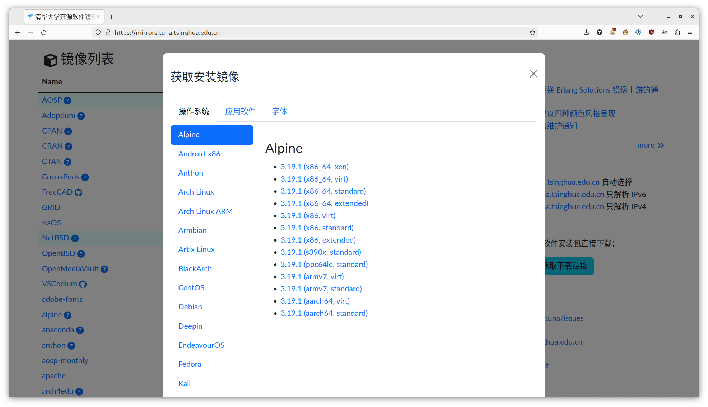
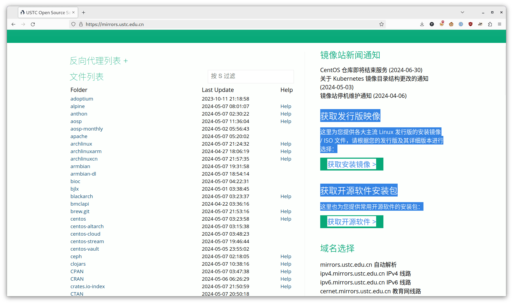
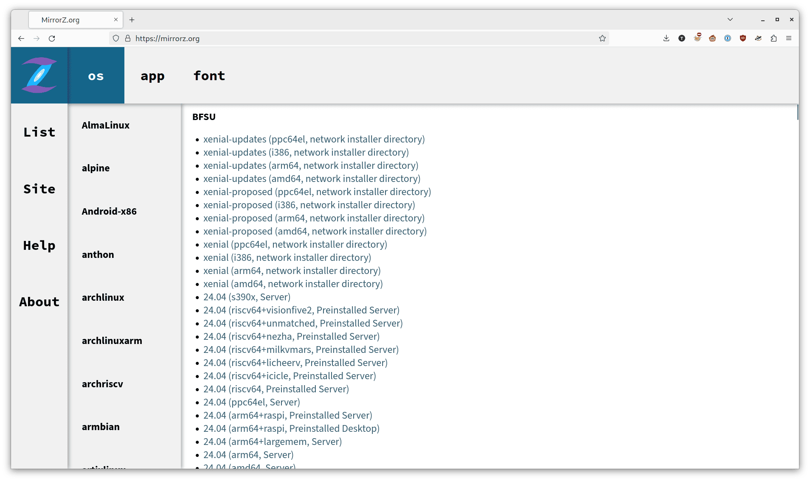

# genisolist [Draft]

`genisolist.ini` 格式有关文档、参考实现与公用配置。

## 简介

### 用途

`genisolist` 用于生成文件下载列表，输出在处理后会用在镜像站以及 MirrorZ 网页端以下地方：

- 镜像站的「获取下载链接」/「获取安装镜像」等页面：

    

    

- [MirrorZ 格式](https://github.com/mirrorz-org/mirrorz?tab=readme-ov-file#data-format-v17)中的 `info` 字段。根据镜像站提供的数据，渲染效果如下图：

    

### 文件格式

`genisolist.ini` 的格式类似于 INI，但是包含 `!include` 标记，用于引入其他文件。参考例子 [example.ini](./example.ini)。

```ini
# %main% contains mirror site specific settings

[%main%]
root = /tmp/genisolist/
urlbase = /

!include includes/distro.ini
!include includes/os/archlinux.ini
!include includes/app/vlc.ini
!include includes/font/google_fonts.ini
```

`!include` 后的路径如果是相对路径，则相对于该 ini 文件的路径。

在 `!include` 被处理后，其是一个与 Python 的 `configparser` 模块兼容的 INI 格式的配置文件。特别地，由于 INI 格式未规定布尔值，下文中的「布尔值」指代转换为小写后值为 `true` 或 `false` 的字符串，其他的值的行为未定义。

INI 格式由多个 **section** 组成，其中 `genisolist.ini` 中以 `%` 开头的 section 为特殊 section，目前定义的特殊 section 如下：

- `%main%`：存储镜像站的特定配置，目前包含 `root`（镜像根目录）和 `urlbase`（镜像站 URL 前缀）。
- `%distro%`（可选）：存储发行版排序的权重。可参考 [./includes/distro.ini](./includes/distro.ini)。早先的版本中这一部分的内容在 `%main%` 中。

其他以 `%` 开头的 section 会被忽略，在新版本的 genisolist 中可能会添加其他的特殊 section。

其他的 section 用于表示展示内容与文件匹配规则，section 的名称（即方括号内的内容）会被忽略，重复的 section 名称出现时的行为未定义。Section 中必须包含以下的字段：

- `distro`：显示名称（发行版名称、软件名称、字体名称等）。允许多个 section 使用相同的显示名称，最终显示时会合并。
- `location` 或 `location_N`（N 为数字，从 0 开始）：文件路径匹配的通配符（glob）规则，在参考实现中使用 `pathlib.Path.glob` 处理。生成器会根据 `root` 与 `location` 获取可能匹配的文件列表。
- `pattern`：文件名正则表达式规则。文件名不匹配的文件会被忽略。正则表达式中允许使用捕获组特性（即使用括号包裹的部分），被捕获的部分可以在 `version`、`type`、`platform`、`key_by`、`sort_by` 中使用。与其他软件类似，`$0` 代表整个匹配的字符串，`$1` 代表第一个捕获组，以此类推。不存在的匹配组以空字符串处理。可以在 <https://regex101.com/> 测试正则表达式行为。

以下是可选字段：

- `listvers`：每个版本列出的文件数量，默认为 255 个。
- `version`：版本号信息。脚本会尝试使用符合版本语义的方式比较不同的版本号。
- `type`：文件类型，默认为空，应对 `version` 与 `platform` 字段无法覆盖的情况。
- `platform`：平台信息。脚本会根据平台的优先级（常见以及重要程度）对不同平台、相同版本的文件排序。
- `category`：分类，默认为 `os`，如果对应的文件为软件或者字体，则需要设置为 `app` 或 `font`。
- `key_by`：Section 内子分组关键字，默认不分组。排序操作在子分组内进行，并且 `listvers` 限制变为对每个子分组内文件数量的限制。
- `sort_by`：排序关键字，覆盖默认的排序规则。默认排序规则为按照以下值作为排序关键字逆序排序：

    ```python
    (
        LooseVersion(file_item["version"]),
        get_platform_priority(file_item["platform"]),
        file_item["type"],
    )
    ```

    `sort_by` 中的值应为空白符分割的捕获组。

- `nosort`：布尔值。默认为 `false`。如果为 `true`，则不对文件进行排序。
- `pattern_use_name`：布尔值。默认为 `false`。如果为 `true`，则 pattern 的正则表达式规则只使用文件名，而非整个文件路径进行正则匹配。

### 输出格式

输出为 JSON，例如下：

```json
[
    {
        "distro": "archlinux",
        "category": "os",
        "urls": [
            {
                "name": "2024.05.01 (x86_64, CLI-only)",
                "url": "/archlinux/iso/latest/archlinux-2024.05.01-x86_64.iso"
            }
        ]
    }
]
```

其中的 `name` 字段，如果对应的文件有 `platform` 字段，那么格式为 `%s (%s%s)`：

- 第一个 `%s` 为 `version` 字段；
- 第二个 `%s` 为 `platform` 字段；
- 第三个 `%s` 为 `type` 字段，格式为 `, {type}`，如果为空则不显示。

如果没有 `platform` 字段，那么值为 `version` 字段。

## 使用

[genisolist.py](./genisolist.py) 为参考实现，用于从配置与本地文件系统输出以上的 JSON 格式。可以使用其 `process_ini()` 和 `gen_from_sections()` 用于整合镜像站点的其他设施，也可以直接运行，例如下：

```console
$ DEBUG=1 python genisolist.py example.ini
DEBUG:__main__:Location: archlinux/iso/latest/archlinux-*.iso
DEBUG:__main__:File: archlinux/iso/latest/archlinux-2024.05.01-x86_64.iso
DEBUG:__main__:Matched: ('2024.05.01', 'x86_64')
DEBUG:__main__:File item: {'path': 'archlinux/iso/latest/archlinux-2024.05.01-x86_64.iso', 'category': 'os', 'distro': 'Arch Linux', 'version': '2024.05.01', 'type': 'CLI-only', 'platform': 'x86_64', 'sort_weight': (LooseVersion ('2024.05.01'), 100, 'CLI-only')}
DEBUG:__main__:File: archlinux/iso/latest/archlinux-x86_64.iso
DEBUG:__main__:Not matched: /tmp/genisolist/archlinux/iso/latest/archlinux-x86_64.iso
DEBUG:__main__:Location: videolan-ftp/vlc/*/*/*
DEBUG:__main__:Location: videolan-ftp/vlc/*/*/*
DEBUG:__main__:Location: videolan-ftp/vlc-android/*/*
DEBUG:__main__:Location: videolan-ftp/vlc-iOS/*/*
DEBUG:__main__:Location: github-release/googlefonts/*/*/*
DEBUG:__main__:Location: github-release/googlefonts/noto-cjk/LatestRelease/*
DEBUG:__main__:Location: github-release/googlefonts/noto-emoji/LatestRelease/*
DEBUG:__main__:Location: github-release/googlefonts/noto-fonts/LatestRelease/*
[{"distro": "Arch Linux", "category": "os", "urls": [{"name": "2024.05.01 (x86_64, CLI-only)", "url": "/archlinux/iso/latest/archlinux-2024.05.01-x86_64.iso"}]}]
```

输出为 JSON 格式的字符串，可以使用 `jq` 等工具做后续处理。对于本地测试，可以使用 [utils/rsync-stub-generator.py](utils/rsync-stub-generator.py) 从镜像站获取文件，并在本地生成一致的目录结构：

```shell
python utils/rsync-stub-generator.py rsync://rsync.mirrors.ustc.edu.cn/archlinux --dist /tmp/genisolist/archlinux
```

对于镜像站点，推荐使用 **git submodule** 的方式引入本仓库：

- 添加 submodule：

    ```shell
    git submodule add https://github.com/mirrorz/genisolist.git mirrorz-genisolist
    ```

- 首次使用：

    ```shell
    git submodule update --init --recursive
    ```

- 更新版本：

    ```shell
    git submodule update --recursive --remote
    ```

同时镜像站点自行维护最外层的 ini 文件，假设在仓库根目录下的 `genisolist.ini`：

```ini
[%main%]
root = /data/
urlbase = /

# 导入 mirrorz/genisolist 的子配置
!include mirrorz-genisolist/includes/distro.ini
!include mirrorz-genisolist/includes/os/archlinux.ini
!include mirrorz-genisolist/includes/app/vlc.ini
!include mirrorz-genisolist/includes/font/google_fonts.ini

# 导入镜像站自己维护的子配置
!include genisolist/os/example.ini
```
